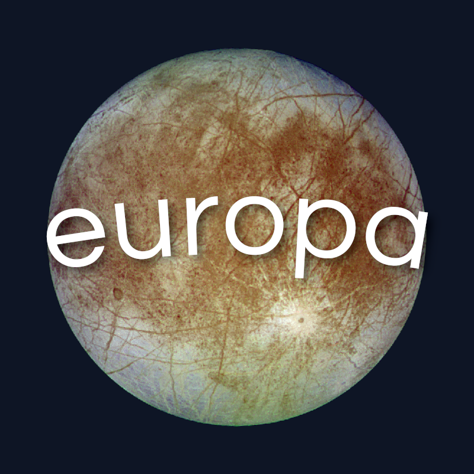

[Discord Server](https://discord.gg/csdaFGd5K9)

# Europa Lang

This language aims to be simple, minimal, and compact. There will not be any classes whatsoever, and importing other files should be painless.

## Example

```europa
use io;

io.println("Hello, World!");
var input = io.readln("");
io.println("You said: " + input);

var map = {{
    "a_map": 'strings can look like this too',
    1 + 1: 'expression keys'
}};

io.println(map['a_map']);
io.println(map[2]);

fn add_two(a, b) {
    return a + b;
}

var a = true;
var b = true;

while true {
    if a == b {
        break;
    } elif a != b {
        continue;
    } else {
        break;
    }
}
```

## Usage

```sh
cargo run -- [file]
```

## Credits

- @justamirror and Dart for name and language design suggestions.
- @CoolCoderSJ for creating the discord server, along with language design suggestions!
- @SixBeeps for designing the Europa logo!
